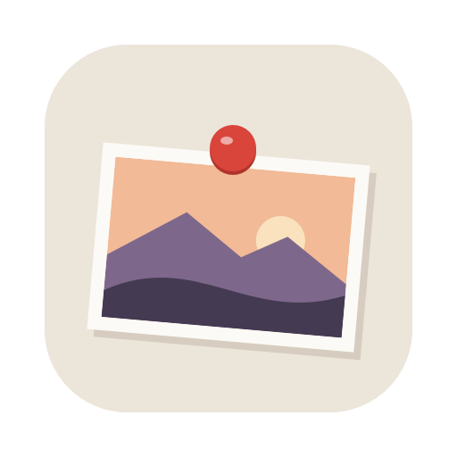
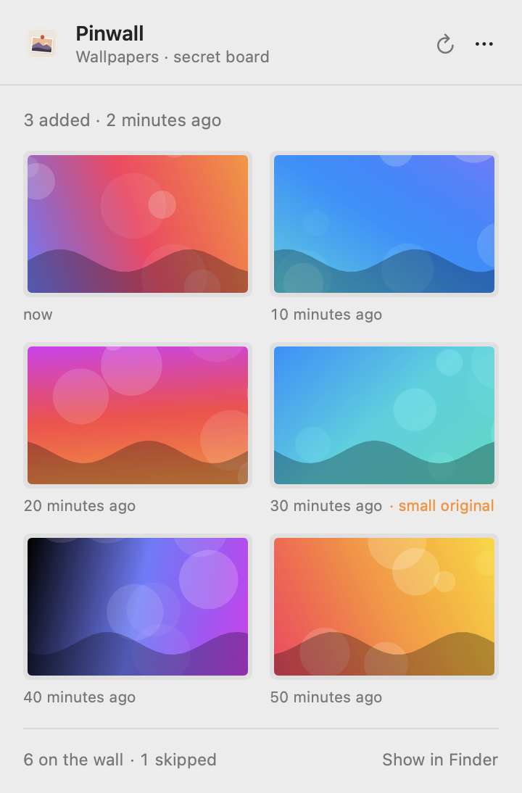
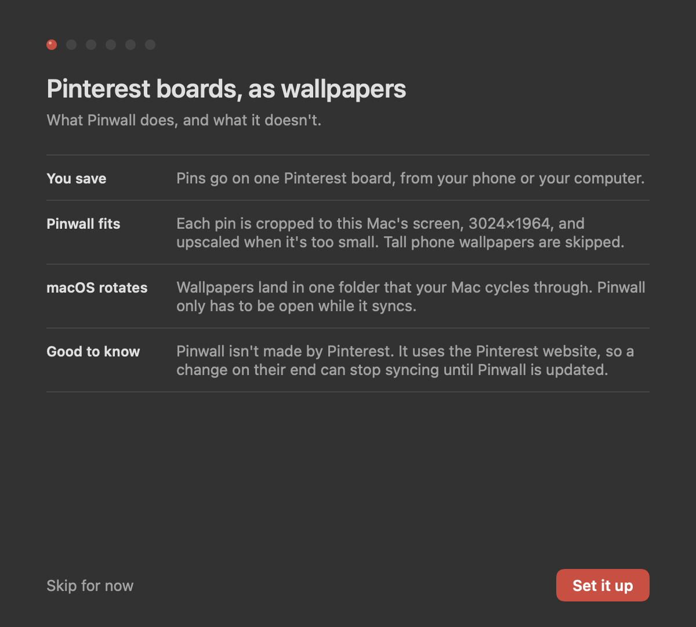
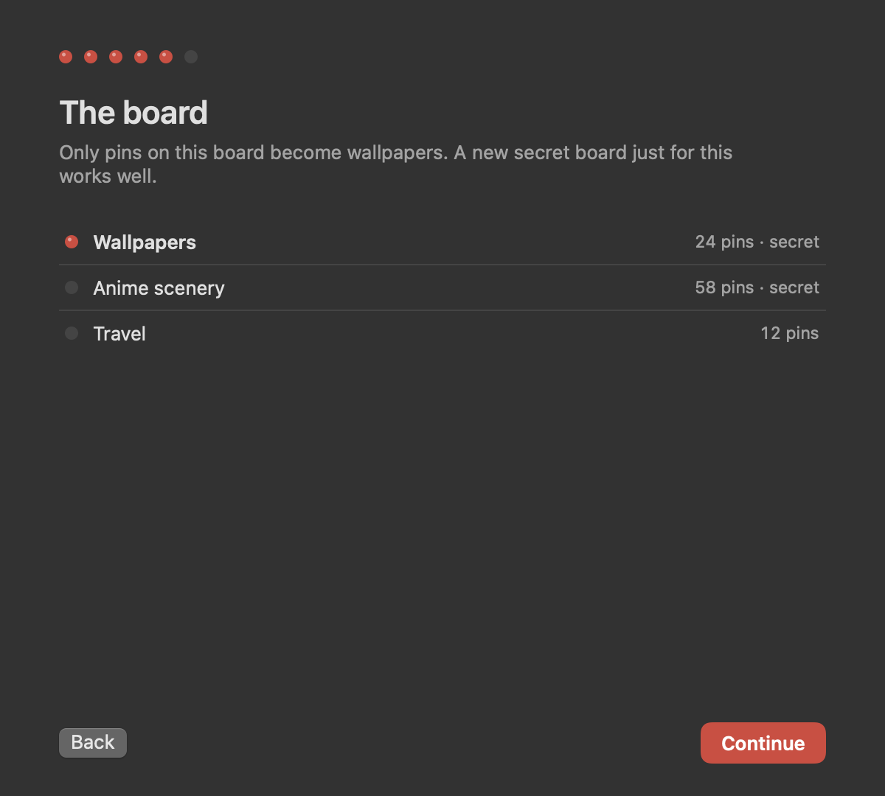

<div align="center">
  
  <h1>Pinwall</h1>
  <p>Save wallpapers to a Pinterest board, and they end up on your Mac's desktop, cropped to the screen and upscaled.</p>

  <p>
    
    
    
  </p>

  <picture>
    <source media="(prefers-color-scheme: dark)" srcset="docs/screenshots/menu-dark.png">
    
  </picture>
</div>

## What it does

- Reads one of your Pinterest boards. Secret boards and private profiles work.
- Crops each pin to your display's exact size and shape, keeping the subject in frame.
- Upscales pins that are too small with [Upscayl](https://upscayl.org), using its Digital art model for anime and illustrations and High fidelity for photos.
- Puts the results in a folder your Mac rotates through, on every desktop.
- Lets you set one as your wallpaper right away, or remove it.

It lives in the menu bar. Open it after you've saved some pins, let it sync, quit it again.

<table>
  <tr>
    <td></td>
    <td></td>
  </tr>
</table>

## Install

You need macOS 15 or later, and [Upscayl](https://upscayl.org) (free) for the upscaling.

1. Download `Pinwall.zip` from [Releases](https://github.com/bonkedbythonk/pinwall/releases) and move Pinwall to Applications.
2. It isn't notarized, so macOS blocks the first launch. Open it once, then go to System Settings > Privacy & Security and click **Open Anyway**. Or run `xattr -dr com.apple.quarantine /Applications/Pinwall.app`.
3. The setup window takes it from there: Upscayl, your Pinterest login, a folder and a board.

## How it gets your pins

Pinterest's API can't read a personal board without an approved developer app, and board RSS feeds stop working for secret boards and private profiles. So Pinwall does what your browser does: you log in on pinterest.com in a Pinwall window, and it asks that page for the pins on your board. Your password goes to Pinterest, never to Pinwall, and the login stays on your Mac.

## Disclaimer

Pinwall isn't made by or affiliated with Pinterest or Upscayl. It depends on how the Pinterest website works today, so a change on their end can stop syncing until Pinwall is updated. Reading your own board from your own account is light use, but automated access may still go against Pinterest's terms; use it at your own discretion.

Personal project, no support promised.

## Building

```bash
swift test
Scripts/compile_and_run.sh
```

`swift Scripts/make_icon.swift` redraws the icon. `Pinwall.app/Contents/MacOS/Pinwall --snapshot <folder>` renders every screen with made-up data, which is where the screenshots above come from.

Licensed under [GPLv3](LICENSE).
